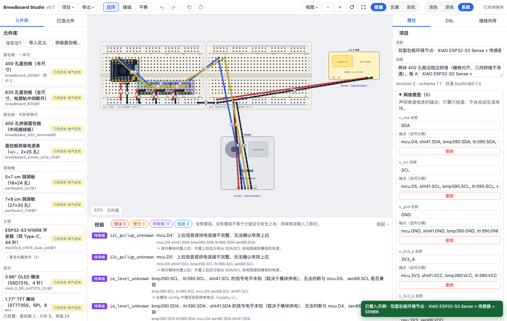
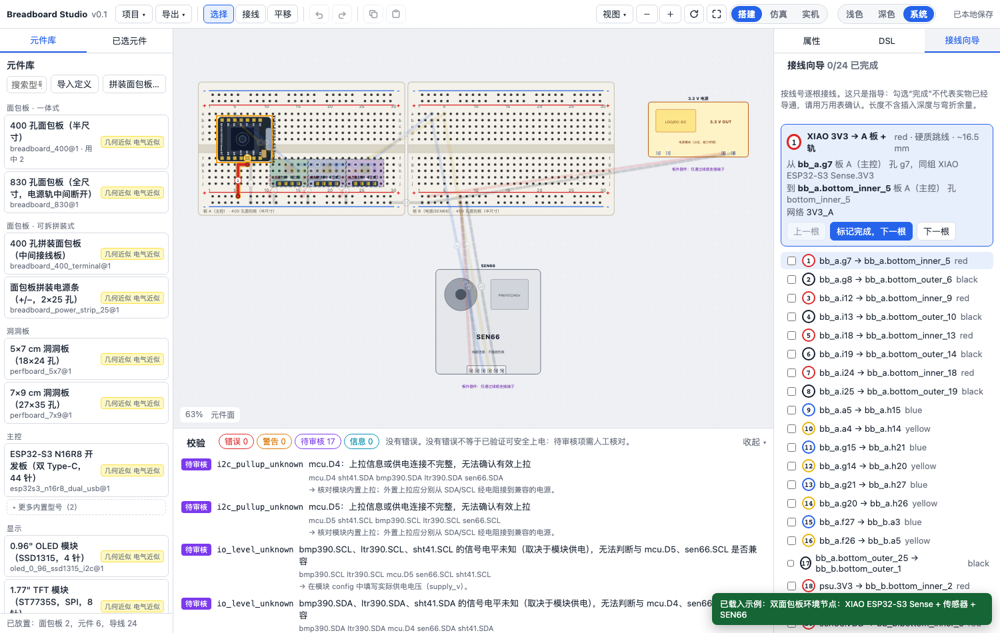

# Breadboard Studio

在浏览器里拼面包板、摆元件、自动接线，再按图搭建你的电路。

Breadboard Studio 是一个开源的面包板布局工具：你可以直接操作画布，也可以让 AI Agent 通过 CLI 和 JSON 设计文件参与搭建。两种方式共用孔位、导通关系和校验规则。

[在线体验](https://7dul2.github.io/breadboard-studio/) · [快速开始](#快速开始) · [贡献元件](CONTRIBUTING.md) · [反馈问题](https://github.com/7dul2/breadboard-studio/issues) · [English](#english)



*环境节点示例。截图中的部分元件来自示例目录，默认元件库展示精选型号。*

## 先试一试

打开 [在线演示](https://7dul2.github.io/breadboard-studio/)，无需安装或登录，建议使用电脑浏览器。

1. 在左上角「项目」菜单中载入一个示例，直接查看完整接线。
2. 点击面包板孔位，观察同组孔和导通网络的高亮。
3. 移动元件、调整导线，查看下方校验提示；可以随时撤销。
4. 打开「搭建」标签，按线号逐根接线，或导出 SVG / PNG 分享布局。

想从零开始？从元件库添加面包板与元件，按 `R` 旋转后点击孔位放置。多选一个主控与外设，即可在右侧选择线材并自动排线。

设计会自动保存在当前浏览器中，也可以导出 `.breadboard.json` 备份、分享或在另一台设备上继续编辑。

> 当前版本提供布局、布线和静态校验，也可以为主控编写程序并**运行**：代码在隔离沙箱里真实执行，能驱动板载 RGB、打印串口、经真实 I²C 总线把画面写进 OLED，并按虚拟时间暂停与单步。见[仿真器方案](docs/SIMULATOR_DESIGN.md)与[实施计划](docs/SIMULATOR_RUNTIME_PLAN.md)。

## 可以怎么玩

### 按实物结构拼板

支持一体式 400 / 830 孔面包板，也支持完全拆开的中间接线板与 `+/−` 电源条。板件可以独立移动、旋转、复制和拼接。

- 一体式 400 孔板上下拼接，当前模型支持 ESP32-S3 N16R8 跨上板 `j` / 下板 `a` 行。
- 可拆拼装式由 300 孔中间板和 2×25 孔电源条组成；两块中间板之间夹一条电源条，支持跨 `h` / `b` 行。
- 拼接只改变物理位置；相邻板件的电源轨不会自动导通。

引脚随锚点落孔，编辑器会区分占用孔与板体遮挡区域，并报告脱格、同孔冲突和板体碰撞。不同实物型号的尺寸仍需核对。

### 选择线材，让工具帮你接线

| 线材 | 画布中的行为 |
| --- | --- |
| 杜邦线 | 两点直连，允许交叉、视觉重叠和跨越元件 |
| 硬质跳线 | 贴板沿水平、垂直方向走线，绕开元件实体，不与其他硬质跳线共用线段 |
| 自动选择 | 根据长度、绕路和跨板情况混合使用两种线材 |

多选一个主控或电源主板与多个外设，自动排线会根据引脚角色规划电源、GND、I²C 和 GPIO 连线。它会利用电源轨、尝试缩短走线，并报告无法连接的引脚；整批操作可以一次撤销。

I²C 地址冲突时，规划器可根据型号能力分配另一条总线或调整地址配置，并提醒你核对硬件和固件。搜索范围、优化策略与 CLI 选项见 [Agent 指南](docs/AGENT_GUIDE.md)。

### 看清元件，也能自己修改外观

悬停元件库条目，即可查看模型预览、尺寸、引脚数量和简介。默认展示：

| 分组 | 型号 |
| --- | --- |
| 一体式面包板 | 400 孔半尺寸、830 孔全尺寸 |
| 可拆拼装式 | 300 孔中间接线板、独立 `+/−` 电源条 |
| 主控 | ESP32-S3 N16R8，双 Type-C、44 针 |
| 显示 | 0.96 英寸 SSD1315 OLED，4 针 |

N16R8 板载 RGB 灯支持输入 RGB 值，OLED 支持白色或蓝色显示外观；这些目前是外观属性。

选中元件后打开「编辑外观绘图…」，可以移动、复制、旋转和删除绘图中的小部件，也可以叠加实物照片对位。板子画错了就用「写回元件库」（本地 `pnpm dev` 下可用），直接覆盖 `packages/catalog/src/definitions/` 里的定义，所有项目一次改好；只想让当前项目长得不一样，用「保存到本项目」。

完整目录还保留 XIAO、传感器等型号供 CLI 和示例使用。你也可以在元件库导入自定义定义，无需修改应用代码，详见[元件建模说明](docs/CATALOG.md)。

### 从屏幕走到实物

导通高亮帮助你检查连接关系；校验面板区分错误、警告和待审核事项。右侧「接线向导」按线号列出两端孔位与颜色，并保存完成进度。



### 搭建与仿真

顶栏右侧的开关把界面分成两半，两边的职责不重叠：

| | 搭建 | 仿真 |
| --- | --- | --- |
| 做什么 | 改电路：放元件、接线、移动、撤销 | 跑程序：运行、暂停、单步、按控件、看串口与引脚 |
| 有什么 | 元件库、工具、撤销/重做、DSL、接线向导 | 运行控件、诊断、串口、网络监视、画布上的按键 |
| 电路 | 可编辑 | 冻结 |

从「仿真」切回「搭建」会结束当前会话——这正是开关的承诺：在搭建里设计总是可改的，在仿真里总是冻结的。会话进行中仍可改的，只有引擎本来就允许的那些：程序源码与仿真参数（改源码会让会话因快照过期而停止）。

## 快速开始

本地开发需要 Node.js ≥ 20.19 和 pnpm 11，仓库指定版本见 [package.json](package.json)。

```bash
git clone https://github.com/7dul2/breadboard-studio.git
cd breadboard-studio
npm install -g pnpm@11.25.0
pnpm install
pnpm dev
```

打开 `http://localhost:5173`。运行 `pnpm build` 后，静态站点输出到 `apps/web/dist`，可部署到自己的服务器。

<details>
<summary>常用操作与快捷键</summary>

| 操作 | 方式 |
| --- | --- |
| 查看模型 | 悬停元件库条目 |
| 添加元件 | 点击条目，再点击孔位放置；`R` 旋转，`Esc` 取消 |
| 多选 | `Shift` 点击或框选 |
| 拼接面包板 | 拖动吸附，或在属性面板选择基准板与拼接方向 |
| 接线 | `W`，依次点击两个孔或端子 |
| 自动排线 | 多选主板与外设 → 右侧「自动排线」 |
| 调整走线 | 选中导线，双击线段添加拐点，拖动拐点调整 |
| 旋转 / 锁定 / 删除 | `R` / `L` / `Delete` |
| 复制 / 剪切 / 粘贴 | `⌘C` / `⌘X` / `⌘V`：粘到指针所在的孔位，和拖放同一套吸附规则；缓冲区存在本地，可跨项目粘贴（不含导线） |
| 就地复制一份 | `⌘D`（副本放在板外） |
| 撤销 / 重做 | `⌘Z` / `⇧⌘Z` |
| 平移 / 适应全部 | 空格拖动 / `F` |
| 编辑设计文件 | 右侧「DSL」编辑草稿，校验后应用 |
| 切换搭建 / 仿真 | 顶栏右上角的开关；编辑类快捷键只在「搭建」下生效 |

</details>

<details>
<summary>开发与验证命令</summary>

```bash
pnpm test                              # 核心、目录、渲染与 CLI 测试
pnpm typecheck                         # 类型检查
pnpm exec playwright install chromium  # 首次运行浏览器测试前安装
pnpm test:e2e                          # 浏览器关键流程
pnpm build                            # 构建静态站点
pnpm perf                             # 4 板 / 20 模块 / 100 线性能样本
```

项目采用 TypeScript、React、SVG 画布与 pnpm workspace。`apps/web` 是编辑器，`packages` 包含 schema、catalog、core、render、sim 和 cli，几何与电气规则由界面和 CLI 共用。

</details>

## 让 Agent 参与搭建

Agent 可以直接读取型号、检查设计、应用补丁和生成布线，不需要通过截图猜测孔位。同一份 `.breadboard.json` 可以在人和 Agent 之间交接。

```bash
# 查看模型和校验已有示例
pnpm bb catalog inspect esp32s3_n16r8_dual_usb@1 --json
pnpm bb validate examples/environment_node.breadboard.json --json

# 为自己的项目试算布线（mcu、oled 是项目中的实例 ID）
pnpm bb autowire design.breadboard.json --host mcu --components oled --dry-run --json

# 检查补丁，并导出布局图
pnpm bb apply design.breadboard.json --patch edits.json --dry-run --json
pnpm bb export design.breadboard.json --format svg --out layout.svg
```

补丁原子执行，结构错误会阻止整批应用；revision / hash 检查可避免并发覆盖。若由程序直接解析 JSON，使用 `node packages/cli/bin/bb.mjs` 入口，避免 pnpm 的错误日志混入输出。

完整命令、补丁示例与自动排线规则见 [Agent 指南](docs/AGENT_GUIDE.md)和[设计文件格式](docs/DESIGN_FORMAT.md)。

## 示例项目

| 示例 | 内容 |
| --- | --- |
| [桌面设备](examples/desk_device.breadboard.json) | ESP32-S3 DevKit + OLED + TTP223，包含电源轨断点桥接 |
| [环境节点](examples/environment_node.breadboard.json) | 双面包板，XIAO + SHT41 / BMP390 / LTR390 + SEN66 |
| [触摸显示](examples/touch_display.breadboard.json) | ESP32-S3 N16R8 + TTP223 + SSD1315 OLED，附一段可编辑、可导出的程序 |
| [压力样本](examples/stress_test.breadboard.json) | 4 块板、20 个模块、100 根线 |
| [自定义元件模板](examples/custom_definition_example.json) | 创建或导入自己的元件定义 |
| [校验反例](examples/invalid) | 短路、断网、地址冲突、无效孔位等测试设计 |

## 当前边界与后续方向

当前模型适合规划布局和辅助接线。内置几何尚未全部实测，针序、排距和电源轨分段需要与你的实物一致；没有错误提示不代表电路已经验证可安全上电。

- 支持 2.54 mm 栅格和 90° 倍数旋转，暂不支持任意针距及三维碰撞分析。
- 静态检查尚未覆盖 I²C 上拉、总线电容和 GPIO 复用等全部条件。
- 自动排线依赖型号数据，复杂布局可能需要手动整理；大网络的优化包含启发式搜索。
- 设计数据保存在浏览器本地，暂无云同步和多人协作；建议定期导出 JSON。

后续重点是补充并实测元件、改进布线体验，以及把交互式仿真做完整。仿真器已完成[阶段 1 到阶段 3](docs/SIMULATOR_RUNTIME_PLAN.md)：用户代码在 QuickJS 沙箱里真实执行，可驱动 ESP32-S3 的 GPIO 与板载 RGB，支持暂停、单步、复位与倍速；触摸键与 BOOT/RST 可以直接在画布上按；I²C 是控制器级的真实总线，SSD1315 OLED 的画面由程序一字节一字节写进去——断线、错地址、没供电各自报出不同的诊断，而不是屏幕默默不亮。分立 LED 也能点亮了：电阻在导通图里是真正的二端元件，`GPIO → 电阻 → LED → GND` 会按预期发光，而电源与地之间的电阻会报出估算电流而不是被误判成短路。SHT4x 温湿度传感器可以读了：在仿真面板拖动温度滑杆，程序下一次测量就会读到新值——命令、转换延时、CRC 一样不少，忘记等待转换完成会像实物一样收到 NACK。LTR390 光照/紫外与 SEN66 空气质量模块也能读了，三种 I²C 寻址形态（命令字、寄存器指针、16 位命令 + 每字 CRC）都建了模。BMP390 还没有驱动。接下来是输入录制回放与网络值时间线（阶段 4 其余部分）。

## 一起完善它

你不必会写代码才能参与：实物尺寸、引脚核对、接线示例、使用反馈都能帮助项目变得更准确。

- [报告问题](https://github.com/7dul2/breadboard-studio/issues/new?template=bug_report.md)：附上复现步骤和可分享的设计文件。
- [请求或补充元件](https://github.com/7dul2/breadboard-studio/issues/new?template=component_definition.md)：提供型号、尺寸、针序与资料来源。
- [提出功能建议](https://github.com/7dul2/breadboard-studio/issues/new?template=feature_request.md)，或按[贡献指南](CONTRIBUTING.md)提交 PR。
- 如果你用它搭出了作品，欢迎在 Issues 分享布局与实物照片。

感谢所有[贡献者](https://github.com/7dul2/breadboard-studio/graphs/contributors)。如果这个工具对你有帮助，欢迎给仓库一个 Star，或把在线演示分享给一起玩电子的朋友。

## 更多文档

[架构与坐标约定](docs/ARCHITECTURE.md) · [设计文件格式](docs/DESIGN_FORMAT.md) · [CLI / Agent](docs/AGENT_GUIDE.md) · [元件建模](docs/CATALOG.md) · [进度与验证记录](docs/STATUS.md) · [仿真器方案](docs/SIMULATOR_DESIGN.md) · [可执行仿真实施计划](docs/SIMULATOR_RUNTIME_PLAN.md)

MIT 许可证，见 [LICENSE](LICENSE)。第三方声明见 [THIRD_PARTY_NOTICES.md](THIRD_PARTY_NOTICES.md)。

## English

**Plan your breadboard circuit in the browser, route its wires, and follow the layout at your workbench.**

Breadboard Studio is an open-source layout editor for people and AI agents. It includes modular breadboards, pin-to-hole placement, manual and automatic routing, copy/paste that drops parts into the holes under your pointer, connectivity highlighting, static validation, an artwork editor, and wire-by-wire build instructions. A switch in the toolbar splits the app in two: 搭建 (build) edits the circuit, 仿真 (simulate) runs it — leaving 仿真 ends the session, so the design is always editable on the build side and always frozen on the other. Export your project as JSON, SVG, or PNG.

Try the [online demo](https://7dul2.github.io/breadboard-studio/) without an account. Load an example from the Project menu to explore a complete design. Projects are saved locally in your browser; JSON export lets you back them up or share them.

The CLI and browser share the same geometry, connectivity graph, and transaction engine. Agents can inspect and edit `.breadboard.json` files directly. See the [Agent guide](docs/AGENT_GUIDE.md) for commands and patch examples.

Programs now run: user code executes in an isolated QuickJS sandbox on a deterministic virtual clock, driving the board's on-board RGB, the serial console and — over a real controller-level I²C bus — the SSD1315 OLED, with pause, single-step, reset and playback speed. Buttons and touch input work on the canvas and reach the program through the real wiring. Cut a wire, use the wrong address or leave the panel unpowered and each fails differently, with a diagnostic that names the fix. Current checks do not replace verification of the actual hardware. Contributions of component definitions, measurements, examples, and fixes are welcome. MIT licensed.
