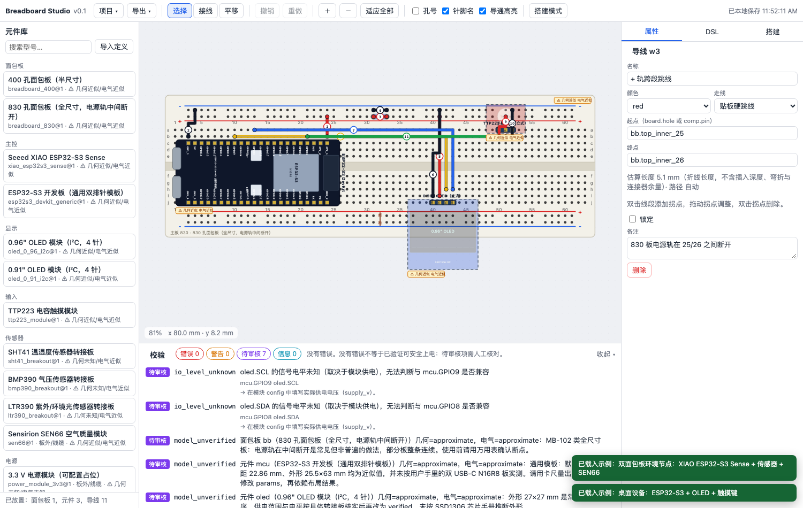

# Breadboard Studio

面向人和 Agent 的面包板布局平台：在浏览器里拖放元件、接线并实时校验；Agent 通过同一套结构化 DSL 与 CLI 完成同样的操作，不需要截图定位或模拟鼠标。设计文件是唯一事实来源，UI 与 CLI 共用几何、导通图、规则和事务引擎。

**在线演示**：https://7dul2.github.io/breadboard-studio/ （静态站点，数据只保存在你的浏览器本地）


> English summary at the end of this file.

## 能做什么（v0.1）

- **真实孔阵的面包板**：一体式 400 孔（轨道连续）、830 孔（轨道在 25/26 断开），以及可拆拼装式的 300 孔中间接线板和独立 2×25 孔 `+/−` 电源条。a–j 行、列号、中央沟槽、独立电源轨与断点都按型号数据绘制；多块板件可拖动吸附，或在属性面板选择基准板、四个拼接方向、机械间距和孔阵对齐。几何拼接不会导通任何电源轨。
- **元件放置**：按锚点引脚落孔，引脚→孔位由几何派生；显示被引脚占用和被板体遮挡的孔；立式模块只占针排；板外器件只能用线缆连接端子；碰撞、脱格、同孔两针会被拒绝。
- **接线**：从明确的孔/端子到孔/端子；杜邦线两点直连，允许视觉重叠/交叉并可跨过元件；硬质跳线贴板走水平/垂直折线，不与其他硬质跳线共用路径，并绕开真正占用板面的元件实体。可拖拐点、改颜色/线号，交叉不导通。
- **自动排线**：多选一个主控/电源主板和若干外设，一键按目录里的电源、GND、I²C、GPIO 角色生成连线。电源/GND 先从最近的主板引脚组馈线到最近的电源轨，再按需跨段、跨板桥接；I²C 沿元件依次串接并让 SDA/SCL 走不同排；每根线的两端都用与画布相同的避障路由器试算后取最短，短线用硬质跳线、跨板/线缆/长线用杜邦线（也可强制全部硬质或全部杜邦）。默认再做**全局优化**：按同一目标函数（走线长度 + 拐弯/杜邦线/线数惩罚）穷举每个网络的生成树和电源轨段组合、对走线顺序做拆线重排，只有优于逐引脚贪心时才采用，并报告目标值、改善幅度和是否穷举。I²C 地址相同的器件不会被接到同一条总线：主板有空闲控制器时启用第二条总线，否则改用模块的另一个地址选项，改动列为待审核；整批操作可一次撤销，无法连接的引脚逐条报告。
- **校验**：格式/放置/面包板/导线/网络/接口/证据七类规则，`error`、`warning`、`needs_review`、`info` 四档；点击结果定位；I²C 地址只在同一实际总线上判冲突；未知数据保留待审核，不给假绿灯。
- **文件**：`.breadboard.json`（JSON Schema 2020-12）导入/导出、浏览器本地自动保存与旧项目恢复、SVG/PNG 导出（含图例与未验证徽标）、逐线搭建模式。
- **Agent/CLI**：`bb catalog | new | inspect | validate | connectivity | apply | autowire | export | steps`，补丁原子应用、revision/hash 防并发覆盖。
- **可扩展目录**：JSON 定义 + 参数化模板，导入自定义元件不需要改应用代码；每个定义仍分别记录几何与电气证据状态，但编辑画布和元件库不显示状态徽标。内置的**外观编辑器**可以直接在元件绘图上移动、复制、删除、旋转小元件，并叠加实物照片对位，结果内嵌到项目或导出为定义 JSON。

**不做**：电流/电压模拟、单片机程序执行、PCB/3D、云端账号与多人协作。自动排线是基于目录引脚角色和几何避障的规划，不是电气仿真；所有“建议”都不宣称是已验证的电气结果。

## 快速开始

需要 Node.js ≥ 20.19 与 pnpm 11（`npm i -g pnpm@11`）。

```bash
git clone https://github.com/7dul2/breadboard-studio.git
cd breadboard-studio
pnpm install
pnpm dev            # 打开 http://localhost:5173
```

其他命令：

```bash
pnpm test           # Vitest：核心/目录/CLI 测试
pnpm test:e2e       # Playwright：浏览器关键流程（首次需 pnpm exec playwright install chromium）
pnpm typecheck
pnpm build          # 生成 apps/web/dist（静态站点）
pnpm perf           # 4 板 / 20 模块 / 100 线性能检查
```

## 编辑器速览

| 操作 | 方式 |
| --- | --- |
| 添加面包板 / 元件 | 左侧元件库点击；元件进入放置模式后在孔上点击落点，`R` 旋转，`Esc` 取消 |
| 选择 / 多选 / 移动 | 选择工具点击、`Shift` 加选、框选；拖动时预览落孔与冲突（红色） |
| 接线 | 接线工具（`W`）依次点击两个孔或端子；点击已插引脚会自动改用同组空孔 |
| 自动排线 | `Shift` 点击或框选一个主板与多个外设，在右侧“自动排线”中确认主板、选择线材（自动 / 全部硬质跳线 / 全部杜邦线）并执行 |
| 调整走线 | 选中导线后双击线段加拐点、拖动拐点、双击拐点删除，属性面板可重置为自动 |
| 旋转 / 锁定 / 删除 / 复制 | `R` / `L` / `Delete` / `⌘D`，或属性面板按钮 |
| 撤销 / 重做 | `⌘Z` / `⇧⌘Z`（含 Agent 批量修改） |
| 缩放 / 平移 | 触控板双指、`⌘`+滚轮缩放、空格拖动或平移工具、`F` 适应全部 |
| 导通高亮 | 点击任意孔显示同组五孔与整个导通网络 |
| 编辑元件外观 | 选中元件 → 属性面板“编辑外观绘图…”：在该型号的 SVG 绘图上点选/框选小元件，拖动、方向键微调、⌘D 复制、Delete 删除、R 旋转；可叠一张实物照片当底图对齐；保存后本项目该型号都用新绘图，“导出定义 JSON”可写回元件库 |
| DSL | 右侧“DSL”标签编辑 JSON 草稿，校验后显式应用；非法草稿不影响画布 |
| 搭建模式 | 右侧“搭建”标签按线号逐根显示两端与颜色，可勾选完成 |


## Agent 与 CLI

```bash
pnpm bb catalog list --json
pnpm bb catalog inspect xiao_esp32s3_sense@1 --json
pnpm bb validate examples/environment_node.breadboard.json --json
pnpm bb connectivity examples/environment_node.breadboard.json --from bb_a.a7 --json
pnpm bb autowire design.breadboard.json --host mcu --components oled,touch --dry-run
pnpm bb autowire design.breadboard.json --host mcu --all --signal touch.IO=GPIO5 --route flat --out wired.breadboard.json
pnpm bb apply design.breadboard.json --patch edits.json --dry-run --json
pnpm bb apply design.breadboard.json --patch edits.json --out revised.breadboard.json --expect-revision 2
pnpm bb export revised.breadboard.json --format svg --out layout.svg
pnpm bb steps revised.breadboard.json --json
```

补丁示例（原子执行；结构非法时全部不应用，电气问题留在草稿并报告）：

```json
{ "expected_revision": 2, "ops": [
  { "op": "add_wire", "wire": { "from": { "pin": "mcu.D4" }, "to": { "pin": "sht41.SDA" }, "color": "blue" } },
  { "op": "update_property", "id": "sht41", "path": "config.i2c_address", "value": 68 }
] }
```

详见 [docs/AGENT_GUIDE.md](docs/AGENT_GUIDE.md)、[docs/DESIGN_FORMAT.md](docs/DESIGN_FORMAT.md)。

## 示例

| 文件 | 内容 |
| --- | --- |
| `examples/desk_device.breadboard.json` | 830 孔板 + 通用 ESP32-S3 DevKit 模板 + 0.96" OLED + TTP223，含跨轨断点跳线 |
| `examples/environment_node.breadboard.json` | 两块 400 孔板拼接：XIAO ESP32-S3 Sense + SHT41/BMP390/LTR390 + 板外 SEN66 + 独立 3.3 V 电源 |
| `examples/stress_test.breadboard.json` | 4 板 / 20 模块 / 100 线性能样本 |
| `examples/invalid/*.breadboard.json` | 短路、断网、无效孔位、重复 ID、I²C 冲突、同孔冲突、未来版本、损坏 JSON 等反例 |
| `examples/custom_definition_example.json` | 自定义元件定义模板 |



## 元件库与真实程度

内置：一体式 400/830 孔面包板、可拆拼装式 300 孔中间接线板与独立 `+/−` 电源条、XIAO ESP32-S3 Sense、通用 ESP32-S3 DevKit 模板、双 Type-C 44 针 ESP32-S3 N16R8、0.96"/0.91" OLED、可切换白色/蓝色显示的 0.96" SSD1315 OLED、TTP223、SHT41/BMP390/LTR390 转接板模板、SEN66（板外线缆）、3.3 V 电源占位、电阻、LED。每个定义分别记录 `geometry_status` 与 `electrical_status`（`verified` / `approximate` / `unknown`）；这些状态不再作为画布或元件库徽标显示，仍供校验与导出使用。建模方法与添加新定义见 [docs/CATALOG.md](docs/CATALOG.md)。

## 已知限制

- 所有内置尺寸来自公开资料或常见值，未经卡尺实测；DevKit 排距、转接板针序必须按实物修改参数。
- 供电评估只做资料数值比较：能力未知或峰值未知一律保留待审核，不判定“足够”。
- 不检查 I²C 上拉、总线电容、GPIO 复用冲突；不做三维碰撞分析；自动排线依赖目录引脚角色，未知或无源引脚会跳过并明确报告；“全局优化”是在给定目标函数下的搜索（小网络穷举，超过 7 个节点的网络和超过 10 段的电源轨用启发式，走线顺序为局部搜索），不是物理上唯一正确的布线，密集线束仍可能需要手动整理。
- 只支持 0/90/180/270° 旋转与 2.54 mm 栅格；不支持非栅格排针（如 2.0 mm）。
- 桌面优先；未针对手机布局；数据只存在浏览器本地（localStorage），请及时导出 JSON。

## 路线图

模型实测校验与 `verified` 标记、更多面包板型号（终端条无轨版、自定义轨道）、I²C 上拉与 GPIO 复用检查、密集布线的线束整理与路径交互优化、贡献者模板校验工具、可选的 MCP 服务封装。

## 文档

- [docs/ARCHITECTURE.md](docs/ARCHITECTURE.md) 单位、坐标、孔名、旋转、规则严重度等约定
- [docs/DESIGN_FORMAT.md](docs/DESIGN_FORMAT.md) 设计文件字段
- [docs/AGENT_GUIDE.md](docs/AGENT_GUIDE.md) CLI 与补丁
- [docs/CATALOG.md](docs/CATALOG.md) 元件建模与来源
- [docs/STATUS.md](docs/STATUS.md) 里程碑进度、验证结果与限制
- [docs/PLAN.md](docs/PLAN.md) 原始执行计划

许可证：MIT（见 [LICENSE](LICENSE)）。第三方声明见 [THIRD_PARTY_NOTICES.md](THIRD_PARTY_NOTICES.md)。

---

## English summary

Breadboard Studio is a browser-based breadboard layout tool for people **and** agents. Humans drag parts and draw wires on an SVG canvas with real hole grids (400/830-point boards, rails with declared breaks, ravine isolation); agents do the same through a declarative JSON DSL (`.breadboard.json`, JSON Schema 2020-12) and a CLI (`bb catalog | inspect | validate | connectivity | apply | autowire | export | steps`) that share the same geometry, net graph, rule engine and atomic transaction layer. Multi-select auto-wiring connects peripherals to one controller/power host by catalog pin roles: power and ground are distributed over the rails (short feeder from the nearest host pin group, then bridges across rail breaks and onto neighbouring boards), I²C chains from module to module, every endpoint pair is trial-routed with the same obstacle-avoiding router the canvas uses, and short runs become hard jumpers while cables, cross-board and long runs become Dupont wires. A global optimiser (exhaustive spanning trees per net, exhaustive rail-segment subsets, rip-up-and-reorder of the jumpers) replaces the greedy plan whenever it scores lower under the same objective and reports what was searched. Rules cover format, placement, wiring, nets, interfaces and evidence with `error / warning / needs_review / info` severities — an absence of errors is never presented as a verified circuit. Exports: SVG/PNG with legend and unverified badges, wire-by-wire build steps. No electrical simulation, PCB or cloud features. MIT licensed.
